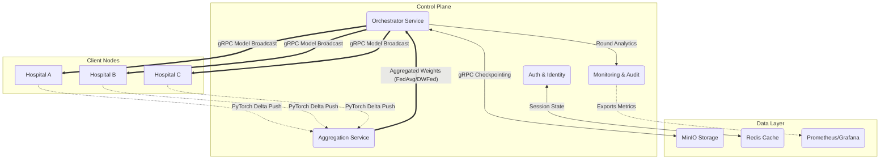

# 🏥 MedFL: Federated Learning Platform

MedFL is a production-grade, decentralized Federated Learning (FL) framework designed specifically for healthcare environments. It securely coordinates deep learning model training across isolated "Hospital Nodes", seamlessly aggregating local insights while ensuring rigorous patient privacy standards using **Opacus Differential Privacy**.

MedFL significantly improves upon standard `FedAvg` by actively deploying the state-of-the-art **DWFed Algorithm** ("Dynamic Weighted Model Aggregation Algorithm for Federated Learning"). By accurately computing the Index of Statistical Heterogeneity (ISH) via Wasserstein Earth Mover's Distance, MedFL actively mitigates volatile model drift stemming from universally unstructured, heavily skewed, or non-IID real-world clinical datasets.

---

## 🏗 System Architecture

MedFL operates as a fully containerized orchestration cluster encompassing 8 interoperating microservices mapping to independent Docker networks.



### 🔹 Microservice Breakdown
1. **Orchestrator (`:8001`, `:50051`)**: The heartbeat of MedFL. Exposes a gRPC subsystem to securely relay and coordinate model deltas to all connected edge devices.
2. **Aggregation (`:8002`)**: Ingests parameter vectors sent by disjoint hospital states. Processes them asynchronously through base `FedAvg` or our core `DWFed` ISH math.
3. **Hospital Nodes (`:8081-3`)**: Isolated clinical boundaries acting as edge execution environments. Triggers local deep PyTorch training using isolated volume-mapped datasets.
4. **Auth (`:8000`)**: Stateless JWT provider dynamically signing validation keys governing inter-service routing policies.
5. **Monitoring & Audit (`:8004`, `:9090`)**: HIPAA-compliant audit registry passively charting real-time Prometheus vectors representing temporal execution states.
6. **MinIO (`:9000`, `:9001`)**: Centralized local S3-compliant artifact registry securely hashing each completed `round_N/model.pt` tensor mapping.
7. **Redis (`:6379`)**: Native caching instance backing the Auth registry mappings.
8. **Grafana (`:3000`)**: Read-only visualization terminal interpreting monitoring data points natively.

---

## 🚀 Quickstart & Deployment

### 1. Prerequisites
Ensure you have the following installed locally:
- **Docker** & **Docker Compose**
- **Make**
- **Python 3.10+** (For Jupyter notebook analytics mapping)

### 2. Seeding Local Data
Hospital volumes deploy empty intentionally to prevent contamination. You **must** populate isolated local patient sets prior to boot.
```bash
# From the repository root
make seed
```

### 3. Build & Initialize Cluster
Launch the full array into detached production loops.
```bash
make up
# Equivalent to: docker compose up --build -d
```

### 4. Running the Smoke Test
The system contains an automated bash and PowerShell suite natively verifying cluster health, routing, registration, and asynchronous cross-validation.
```powershell
# Windows PowerShell
.\smoke_test.ps1

# Linux / MacOS
bash smoke_test.sh
```

---

## 📊 Analytics & Reporting

MedFL exposes detailed comparison APIs charting standard convergence metrics cleanly against dynamic `ISH` weighting sequences mapped throughout global evaluation.

**Trigger an Automated Round via REST**:
```bash
curl -X POST http://localhost:8001/rounds/start \
  -H "Content-Type: application/json" \
  -d '{"hospital_ids":["hospital-a","hospital-b","hospital-c"], "algorithm":"dwfed"}'
```

**Evaluate Benchmarks Dynamically**:
Once your tests complete, run the provided Jupyter suite to evaluate exact mapping improvements generated by DWFed:
```bash
jupyter notebook notebooks/dwfed_comparison.ipynb
```

### Key Reference Endpoints (Local)
| Service | Environment Link |
|---------|-----------------|
| **Grafana Dashboards** | [http://localhost:3000](http://localhost:3000) (admin/medfl) |
| **MinIO Artifacts** | [http://localhost:9001](http://localhost:9001) (medfl/medfl-secret) |
| **Auth Docs** | [http://localhost:8000/docs](http://localhost:8000/docs) |
| **Orchestrator Docs** | [http://localhost:8001/docs](http://localhost:8001/docs) |
| **Monitoring Docs** | [http://localhost:8004/docs](http://localhost:8004/docs) |

---
*Reference Specification: Dynamic Weighted Federated Learning (Frontiers in Neurorobotics, 2022).*
