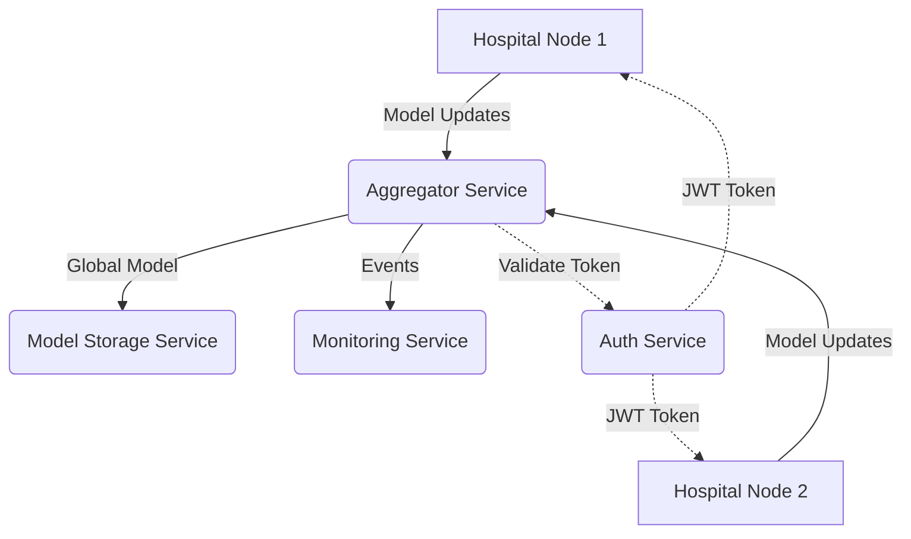

# MedFL: Medical Federated Learning Platform

MedFL is a secure and scalable Federated Learning (FL) framework designed for healthcare institutions. It enables collaborative machine learning training across distributed hospital nodes without sharing sensitive patient data, ensuring privacy and compliance with regulations like HIPAA.

## 🏗️ Architecture

The platform follows a microservices architecture, where each component handles a specific part of the federated learning lifecycle.



---

## 🚀 Core Features

- **Privacy-Preserving Training**: Patient data stays on-premise at hospital nodes.
- **Federated Averaging (FedAvg)**: Weighted aggregation of model weights based on data size.
- **Byzantine Fault Detection**: Automatically rejects malicious or extreme model updates.
- **JWT-based Security**: Secure communication between nodes and the aggregator.
- **Monitoring & Logging**: Real-time tracking of training rounds and system health.
- **Model Checkpointing**: Persistent storage for global model versions.

---

## 🛠️ Service Breakdown

### 🔬 [Aggregator Service](./aggregator-service)
The central orchestrator of the FL process.
- **Aggregation Logic**: Implements the `FedAvg` algorithm.
- **Security Check**: Filters out malicious updates using a threshold-based Byzantine detector.
- **Endpoints**:
    - `POST /receive-update`: Collects model weights from hospitals.
    - `POST /aggregate`: Triggers the weight aggregation process.
    - `GET /send-model`: Distributes the latest global model.
    - `GET /health`: Returns service status and pending updates count.

### 🏥 [Hospital Node](./hospital-node)
A simulation of a hospital's local training environment.
- **Local Training**: Simulates model training and weight generation.
- **Data Submission**: Authenticates with the `Auth Service` and sends updates to the `Aggregator`.
- **Endpoints**:
    - `GET /train`: Triggers a local training round and submits weights.

### 🔐 [Auth Service](./auth-service)
Handles identity and access management.
- **Authentication**: Issues JWT tokens for registered hospital nodes.
- **Validation**: Verifies token authenticity for the Aggregator.

### 💾 [Model Storage Service](./model-storage-service)
Provides a simple interface for persisting the global model checkpoints.

### 📊 [Monitoring Service](./monitoring-service)
Centralized logging for all FL events, including training progress and security alerts.

---

## 🏁 Getting Started

### Prerequisites
- [Docker](https://www.docker.com/get-started) & Docker Compose
- [Python 3.9+](https://www.python.org/downloads/) (for local development)

### Deployment with Docker
To spin up the entire MedFL environment:

1. Clone the repository:
   ```bash
   git clone https://github.com/Dhruvi-Rana09/MedFL.git
   cd MedFL
   ```

2. Start the services:
   ```bash
   docker-compose up --build
   ```

3. The services will be available at:
    - **Aggregator**: `http://localhost:8000`
    - **Hospital 1**: `http://localhost:8001`
    - **Hospital 2**: `http://localhost:8002`
    - **Auth Service**: `http://localhost:8003`

---

## 📖 Usage Example

To simulate a training round:

1. **Trigger training** at a hospital node:
   ```bash
   curl http://localhost:8001/train
   ```

2. **Check aggregator health** to see pending updates:
   ```bash
   curl http://localhost:8000/health
   ```

3. **Aggregate updates** once the minimum number of updates is reached:
   ```bash
   curl -X POST http://localhost:8000/aggregate
   ```

4. **Retrieve the global model**:
   ```bash
   curl http://localhost:8000/send-model
   ```

---

## 🔮 Future Roadmap
- [ ] Integration with **MinIO** for large-scale model storage.
- [ ] Transition from HTTP to **gRPC** for low-latency communication.
- [ ] Support for **Differential Privacy** to further enhance security.
- [ ] Real-world dataset integration (e.g., MNIST, Chest X-Ray).
